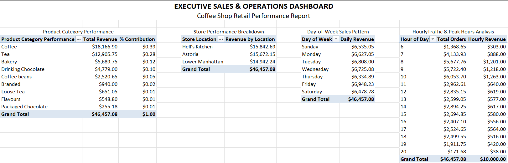
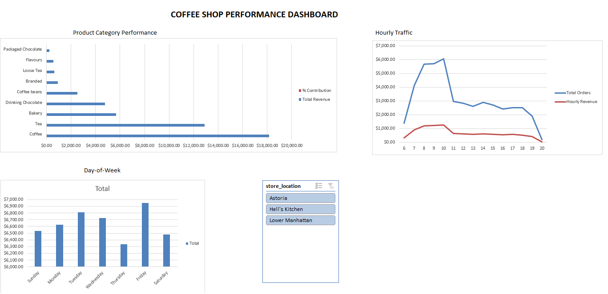
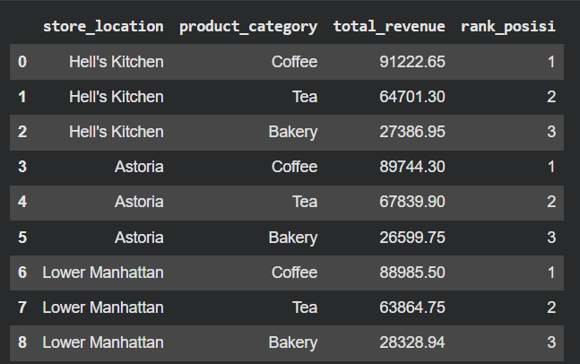
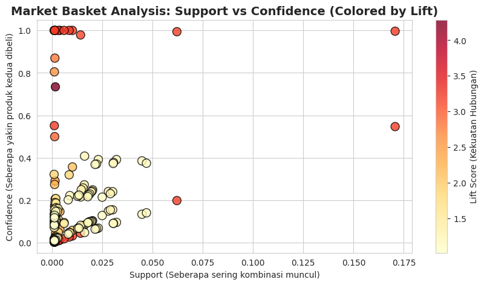

# ☕ Coffee Shop Retail Intelligence: End-to-End Analytics & Bundling Strategy


Proyek analisis data ritel komprehensif menggunakan **149.116 baris transaksi** dari 3 cabang kedai kopi di New York City (*Lower Manhattan, Hell's Kitchen, dan Astoria*). Proyek ini mensimulasikan siklus kerja nyata seorang Data Analyst: mulai dari eksplorasi spreadsheet, kueri database relasional tingkat lanjut, hingga penambangan pola belanja (*data mining*) berbasis algoritma Machine Learning untuk meningkatkan pendapatan bisnis.

---

## 📌 Ringkasan Eksekutif & Masalah Bisnis

Dalam industri ritel F&B, biaya akuisisi pelanggan baru (*Customer Acquisition Cost*) relatif mahal. Kunci pertumbuhan omzet yang sehat adalah memaksimalkan keranjang belanja pelanggan yang sudah datang (*Average Order Value / AOV*).

**Tantangan Utama:**
1. Bagaimana performa penjualan di masing-masing cabang toko dan kapan jam puncak (*peak hours*) operasional terjadi?
2. Produk apa saja yang mendominasi omzet dan bagaimana peringkatnya di tiap cabang?
3. Mengapa mayoritas transaksi hanya membeli 1 item, dan bagaimana pola belanja kombinasi produk (*cross-selling*) dapat dimanfaatkan untuk membuat paket bundling menu?

---

## 🛠️ Arsitektur Proyek & Pembagian Alat

| Alat | Volume Data | Peran & Metodologi |
| :--- | :--- | :--- |
| **Microsoft Excel** | 10.000 Sampel | *Data modeling relasional (VLOOKUP/XLOOKUP), agregasi multi-Pivot Table, dan pembangunan Interactive Executive Dashboard dengan kontrol Slicer.* |
| **SQL (DuckDB)** | 149.116 Data Penuh | *Analisis database mendalam, agregasi omzet, Common Table Expressions (CTE `WITH`), dan pemeringkatan Window Functions (`DENSE_RANK`).* |
| **Python** | 149.116 Data Penuh | *Market Basket Analysis (MBA) menggunakan algoritma FP-Growth untuk mengekstraksi aturan asosiasi produk (Support, Confidence, Lift).* |

---

## 📊 Bagian 1: Excel — Executive Operations Dashboard

Pada tahap awal, 10.000 sampel transaksi dihubungkan secara relasional dengan tabel referensi master produk dan toko. Analisis dirangkum ke dalam lembar kerja eksekutif terstruktur sebelum divisualisasikan.

### 1. Multi-Pivot Table Architecture
Penyusunan 4 dimensi bisnis (*Produk, Lokasi Toko, Hari, dan Jam*) dalam satu grid lembar kerja terpadu:


### 2. Interactive Executive Dashboard
Dashboard interaktif yang dilengkapi dengan visualisasi matriks waktu dan kontrol *Slicer* multi-koneksi:


**Insight Kunci Excel:**
* **Jam Puncak (*Morning Rush*):** Terjadi lonjakan transaksi signifikan pada pukul **08.00 – 10.00 pagi** di semua cabang.
* **Kategori Dominan:** Kategori *Coffee* menyumbang lebih dari 39% total pendapatan, diikuti oleh *Tea* (28%) dan *Bakery* (12%).

---

## 🗄️ Bagian 2: SQL — Advanced Analytical Querying

Seluruh 149.116 baris transaksi dimuat ke dalam mesin database SQL untuk menjawab pertanyaan analitis kompleks yang melampaui kemampuan spreadsheet.

### 1. Masalah Ukuran Keranjang (Basket Size)
Melalui kueri logika `CASE WHEN`, terungkap struktur transaksi kafe:
* **Kecil (1 pcs):** 87.159 transaksi (**~58.4%**)
* **Sedang (2 pcs):** 58.642 transaksi (**~39.3%**)
* **Besar (> 2 pcs):** 3.315 transaksi (**~2.3%**)

> **Temuan Kritis:** Hampir 60% pembeli hanya memesan 1 item. Ini membuktikan secara matematis perlunya strategi *cross-selling* aktif di kasir.

### 2. Window Function: Peringkat Top-3 Produk per Cabang Toko
Menggunakan kombinasi **CTE (`WITH`)** dan **`DENSE_RANK() OVER (PARTITION BY ...)`** untuk melihat 3 kategori terlaris di setiap cabang:



**Hasil Kueri:**
Pola konsumsi di ketiga cabang terbukti identik secara struktur:
1. **Rank 1:** *Coffee* (Rata-rata omzet ~$89k - $91k per cabang)
2. **Rank 2:** *Tea* (Rata-rata omzet ~$63k - $67k per cabang)
3. **Rank 3:** *Bakery* (Rata-rata omzet ~$26k - $28k per cabang)

---

## 🧠 Bagian 3: Python — Market Basket Analysis (FP-Growth)

Untuk mengatasi masalah 58% pembeli yang hanya memesan 1 barang, algoritma penambangan asosiasi **FP-Growth (Frequent Pattern Growth)** dijalankan pada transaksi multi-item untuk menemukan produk yang paling sering dibeli bersamaan.

### Distribusi Aturan Asosiasi (Support vs. Confidence vs. Lift)


### 🎯 Temuan Aturan Belanja Kunci:
1. **The "Home Barista" Persona (Aturan Terkuat):**
   $$\text{[Barista Espresso, Gourmet Beans]} \longrightarrow \text{[Regular syrup]}$$
   * **Confidence: 73.4%** | **Lift: 4.28**
   * *Artinya:* Dari seluruh pelanggan yang membeli biji kopi dan espresso, **73.4% di antaranya pasti ikut membeli sirup botolan**. Nilai Lift 4.28 membuktikan kecenderungan ini **4 kali lebih tinggi** dibanding pembeli biasa.
2. **Merchandise Triggers Add-on:**
   $$\text{[Barista Espresso, Housewares]} \longrightarrow \text{[Regular syrup]}$$
   * **Confidence: 55.2%** | **Lift: 3.22**
   * Pelanggan yang membeli merchandise/alat seduh memiliki kecenderungan tinggi untuk menambah sirup perasa.
3. **Produk Jangkar (*Traffic Drivers*):**
   * **Scone (Support: 33.2%)** dan **Barista Espresso (Support: 31.2%)** adalah produk yang paling sering muncul di keranjang belanja bersama item lain.

---

## 💡 Rekomendasi Strategis untuk Manajemen Bisnis

Berdasarkan temuan holistik dari ketiga alat analisis di atas, berikut adalah 4 usulan strategis untuk manajemen kedai kopi:

1. **Paket Promo Bundling "Home Barista Kit":**
   * Buat paket promo terpadu: *"Beli 1 Pack Gourmet Beans + Barista Espresso, dapatkan diskon 25% untuk botol Regular Syrup"*. Ini langsung mengonversi 73% potensi belanja pelanggan segmen peracik kopi rumahan.
2. **Penataan Etalase Kasir (*Visual Merchandising*):**
   * Jangan meletakkan sirup botolan di area gudang/belakang bar. **Pajang rak sirup tepat di sebelah etalase Biji Kopi dan Merchandise/Tumbler**.
3. **Paket Sarapan Pagi Cepat Saji (*Grab-and-Go Morning Pairing*):**
   * Memanfaatkan temuan bahwa *Scone* muncul di 33% transaksi multi-item dan lonjakan transaksi jam 08.00–10.00, luncurkan paket *"Morning Fuel: Barista Espresso + Ginger Scone"* dengan pemesanan satu tombol di kasir untuk mempercepat antrean.
4. **Optimasi Alokasi Staf Kasir & Barista:**
   * Jadwalkan kapasitas penuh barista (3-4 staf) pada jam sibuk 08.00–10.00. Kurangi jadwal aktif dan alokasikan waktu untuk pembersihan mesin/istirahat pada jam sepi pukul 14.00–16.00.

---

## 📂 Struktur Repositori

```text
├── assets/
│   ├── excel-pivot-summary.png
│   ├── excel-interactive-dashboard.png
│   ├── sql-window-function-ranking.png
│   └── python-mba-rules-distribution.png
├── data/
│   ├── dataset_link.txt
│   └── sample_coffee_10k.xlsx
├── excel/
│   └── Coffee_Shop_Dashboard.xlsx
├── sql/
│   └── coffee_shop_queries.ipynb
├── python/
│   └── MBA (149k Coffee Shop Sales).ipynb
└── README.md
```

---

## 🚀 Cara Menjalankan Proyek Secara Lokal

1. **Excel:** Buka file `/excel/Coffee_Shop_Dashboard.xlsx` menggunakan Microsoft Excel untuk melihat Pivot Table dan Dashboard interaktif dengan Slicer.
2. **SQL:** Buka notebook `/sql/coffee_shop_queries.ipynb` di Google Colab untuk menjalankan kueri database DuckDB (CTEs dan Window Functions).
3. **Python:** Buka notebook `/python/MBA (149k Coffee Shop Sales).ipynb` di Google Colab untuk menjalankan pemodelan Market Basket Analysis algoritma FP-Growth.

---
*Dianalisis dan dikembangkan oleh **Annisa Tristanti** — Proyek Portofolio Data Analyst*
